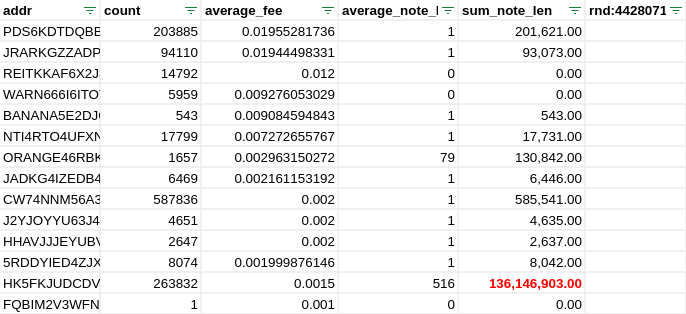
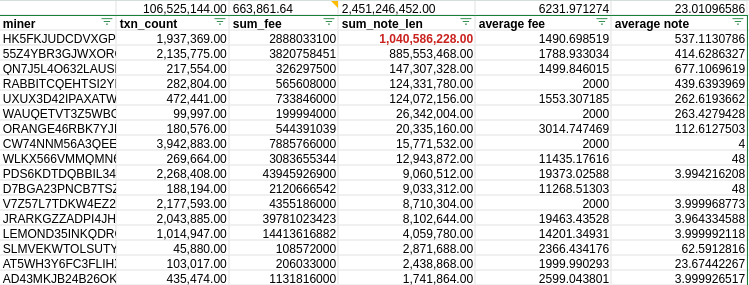

[TL;DR at bottom](#co-signers)

## Preface

Let me preface this by stating my own opinion about, and relationship with, Ora.

I like Ora. I use Ora. I can even claim to being a kind of Godfather to it, having "given" it asset ID 1284444444.

In light of the first Ora halving, I took a look at Ora statistics and mining practices. My objective here is to make a recommendation on Ora mining practices to reduce Ora's negative externalities on Algorand infrastructure, while at the same time appreciating the positive externalities.

## 1. TPS records and Transaction Sizes

Ora community members on X and Discord have been discussing setting new TPS records with Ora. This is not possible:

Best case scenario for ora transaction sizes is usually between 380 - 420 bytes, assuming no notes are used. A block on Algorand has a 5MB size limit for transactions, so taking an optimistic 400 bytes per transaction and 2.9 second block times, we get a theoretical maximum of ~4519 TPS (5 * 1024 * 1024 / 400 / 2.9).

This has been beat several times: 

- outer ALGO payment transactions (~194 bytes) at [5K TPS sustained](https://x.com/d13_co/status/1789451966956880135)
- outer USDC asset transfers at 5.7K TPS sustained (current chainspect record - still owe you a writeup for that)
- blocks with [58888](https://algo.surf/block/25836244) and [51895](https://algo.surf/block/25808869) transactions, etc.

Breaking these records would likely involve either small transactions (under 200 bytes) or heavy use of inner transactions.

## 2. Externalities

> An externality is a cost or benefit that is caused by one party but financially incurred or received by another. Externalities can be negative or positive. A negative externality is the indirect imposition of a cost by one party onto another. A positive externality, on the other hand, is when one party receives an indirect benefit as a result of actions taken by another.

Ora is all about externalities - both positive and negative.

### Positive externalities

Ora's primary positive externality is funding the fee sink. At the time of writing, 2,854,139.97 ALGO has been sent to the fee sink via Ora mining.

_Note: the "time of writing" spanned a few days, so the numbers are not going to be 100% consistent to a single point in time._

Funding the fee sink is important: when ALGO supply is 100% circulating, the fee sink will be the primary source of funding for network security, ecosystem support, etc. The upcoming staking rewards (block production incentives) will also be funded by the fee sink, soon to be boosted by a hefty supplement by the Algorand Foundation.

### Mixed externalities

Another externality is the mining transactions themselves. This is mixed, with the positive being boosting TPS and overall transactions on Algorand, while at the same time, imposing a cost on the ecosystem infrastructure.

At the time of writing, Ora stands at an impressive 436,327,140 lifetime transactions. Algorand Mainnet has 2,483,096,263 total transactions, meaning Ora accounts for 17.57% of all transactions on Mainnet.

---

A lot of nodes on Algorand are "light", in that they keep the latest 1320 blocks and are "unburdened by what has been", i.e. the entire history of the blockchain.

However, the entire blockchain history is still necessary to store, mostly in two forms:

- Archival algod nodes: these nodes store every Algorand block since genesis.
  - You can not trustlessly validate the history of the chain without them.
  - Custom indexers require "conduit" to feed from follower nodes, which in turn require archivals to feed them historical data.
- Indexers: general purpose databases that link accounts, assets, and applications to specific transactions.
  - Used by explorers 
  - Used for lookups that algod is not optimized for, such as "which accounts are opted in to asset X".

At 44+ million blocks and 2.4+ billion transactions, both are hefty to store already.

My mainnet archival algod node has total ledger size 1953571409920 bytes (1.77 TB), of which 1887219470336 bytes (1.71 TB) is the block ledger (ledger.block.sqlite)

Indexers are heavier still. My mainnet indexer data directory is currently sweating at 3310307028 bytes (3.1TB). The vast majority of this weight is in the following two tables, which store transactions (2.2 TB) and relations between accounts and transactions (827 GB), totalling 3074 GB (3 TB)

```
                 table_name                | table_size | indexes_size | total_size
-------------------------------------------+------------+--------------+------------
 "public"."txn"                            | 1989 GB    | 258 GB       | 2247 GB
 "public"."txn_participation"              | 318 GB     | 509 GB       | 827 GB
```

Transactions do not all "weigh" the same, but a back of the envelope division gives us:

- Average block ledger space per txn: ~760.03 bytes
- Average indexer space per txn: ~1329.26 bytes (txn & txn_participation tables)

To get a ballpark estimate of Ora's share of archival storage, I will provide one minimum estimate with the 400 byte best-case Ora transaction size (which will be an undercount as it does not include other overheads for storage) and one with the average transaction size of 760 bytes (which may be an overestimate)

- 436327140 * 400 = 162.54 GB
- 436327140 * 760 = 308.83 GB

For indexers we will use the average 1329.26 byte size for lack of a better metric:

- 436327140 * 1329.26 = 540.16 GB

While these are ball park estimates, it is certain that almost half a billion transactions comes at a cost to the infrastructure that must store it and serve it at dwindling-attention-span speeds.

## 3. Ora mining parameters

Ora mining is dictated by the smart contract logic, which specifies certain parameters that must be met for a mining transaction to be valid.

The contract specifies a range of valid transaction fees per Ora application call. This range is 0.001 ALGO* to 0.02 ALGO.

_* This minimum is 0.002 ALGO when there is an Ora payout to be made from a previous round._

## 4. A week in the life, and some extremes

[This spreadsheet](https://docs.google.com/spreadsheets/d/1kcnTMHFJYA8iLkoeMGL0WF-ui3eZtM0NGh1rlbNwlPw/edit?gid=1292650858#gid=1292650858) shows fees and note sizes in the days leading up to the halving.

On one hand, we see a skew towards smaller fees as opposed to larger, so more transactions overall.

In the example below, 867,041 transactions (71.52% of daily) were at the minimum fee of 0.002 ALGO.



But I also want to point out why a few hundred pointless bytes in note fields can become a problem when done a quarter million times a day.

The `HK5FKJ..` miner has mined 215526 + 263832 + 247932 = 727290 transactions over days 5, 6 and 7. Under `sum_note_len` you see the sum of all transaction notes' lengths.

Counted in MB, just the note fields from this miner add up to 87MB, 129MB & 97MB, for a grand total of three days' worth of notes taking up 314.65 MB.

## 5. months in the life

In [this spreadsheet](https://docs.google.com/spreadsheets/d/1IaDZzKeunrkDedqGgllYAwm3zKpSckp1Nav6mPZFzBw/edit?gid=294625563#gid=294625563) you can see fees and note statistics for approx. 5 months of Ora, June 22nd until "the time of writing".

This data accounts for 106.5 million Ora transactions, about 25% of lifetime count. _Note: I tried to run this query for the entire year of Ora mining, but it ate through my available 280GB of free space and failed to complete. The query above took 4 hours to return._



Some interesting statistics:

- Average fee: 6232 microALGO
- Total raw notes length: 2,451,246,452 bytes (2.28 GB)
  - Top 5 note senders account for 95% of the total

## 6. Ora best (?) mining practices

Everything I've seen from the Ora community makes me believe that they are absolutely aligned with the success of Algorand and our broader ecosystem.

It is in this spirit that I suggest that the best practice for Ora mining should also take into account the overhead incurred on archival nodes and indexers.

**In practice this would mean:**

- **Remove or minimize the note field.**
- **Opt for mining with the maximum Ora transaction fees, 0.02 ALGO.**

### Fewer transactions, same outcomes

From a miner point of view, 10 transactions with 0.002 fee are equivalent to 1 transaction with 0.02 fee. The same work (Ora effort) is being produced, the same fees are paid into the sink.

The major difference is that archivals and indexers need to store 10 transactions instead of 1, and over hundreds of millions of transactions, this overhead adds up to something significant.



I pulled some statistics for the lifetime average fee paid by Ora miners:

- Ora transaction count: 436350671
- Ora transactions' average fee: 0.006540 ALGO
- Ora total fees: 2,854,139.97 ALGO

If you embrace mining closer to 0.02 fees than 0.002, the same work product will be possible with a lot less overhead on the infrastructure.

### "No notes"

Ideally Ora miners would not include notes in their transactions. In certain cases, miners are inadvertently settings notes to hundreds of bytes. This is not beneficial to anyone.



If you use an explorer, check the base64 or hex representation of the note field in your mining transactions. These two screenshots are the same note - it looks deceptively short when shown as a number, but in fact takes up 411 bytes:

 

## 7. Wrapping Up

This isn't about avoiding to use the chain, but any good thing times ~half a billion can become a concern. The Ora miners and community are very proud of the mechanics of Ora and their contributions to the fee sink, but the negative externalities of current mining practices must also be considered, particularly if small changes can ease the burden moving forward.

The ledger is there to be filled, but growing it more/faster than necessary incurs additional costs on the infrastructure of our ecosystem. If you are aligned with the success of our ecosystem, and in particular with our infrastructure providers, consider changing your mining practices to reflect that.

Slower growth in ledger space (archival algod) means the ecosystem as a whole can keep costs lower for longer.

Indexers are also useful to everyone. If a mature project has their own custom indexer built via conduit, props to them, but we all use indexers every day, whether we know it or not. Free indexers being available to everyone also means that developer and project onboarding is much easier.

Ora miners can choose to keep doing what they're are doing, but with ~10x+ less impact to our common infrastructure, if they embrace the two points mentioned above: fewer overall transactions, and smaller individual transaction sizes.

## Co-signers

This is the gist of this open letter:

> Dear Ora Miners,
> 
> Consider minimizing the load of Ora on our common infrastructure. Without sacrificing anything of substance, you can switch to mining with maximum fees (0.02 ALGO) and without excessive notes in your transactions.

---

If you want to co-sign the abbreviated gist above, you can do so on-chain.

<div id="subsign-sign">
  <button onclick="sign()">SIGN</button>
</div>

---

This message has been signed by:

<link href="style.css" rel="stylesheet" />
<div id="subsigners-custom" style="margin-bottom: 20px">
  <div id="subsigners-list">
  </div>
  <div id="status">
    (Loading)
  </div>
</div>
<script src="cosign.js" ></script>
