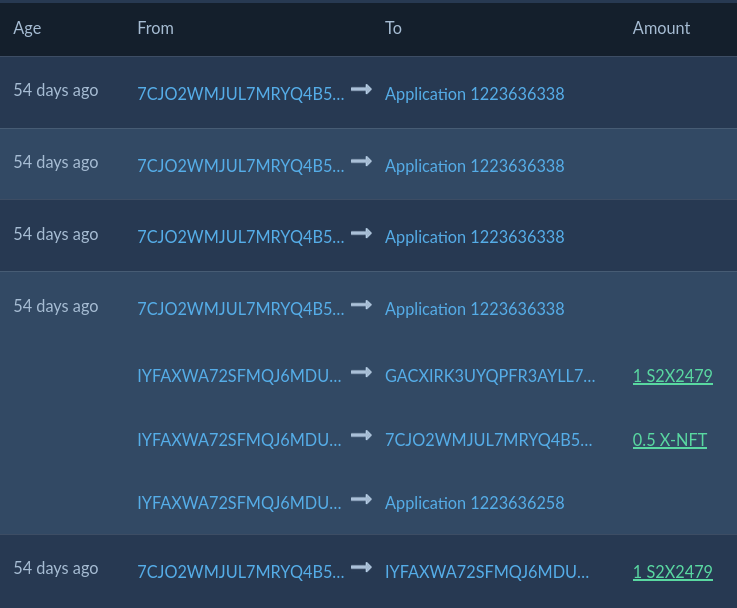
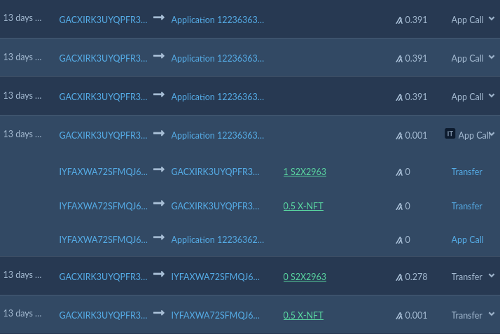

I discovered and disclosed a vulnerability in the Hone NFT shuffle contracts. They responded well. This story is almost boring.

## The backstory

I was curious about the mechanics of the Hone NFT shuffle, as it utilizes VRF, in which I have a keen interest. Reading TEAL is a bit like reading assembly, but with enough determination and a bit of practice you can figure out what a contract is doing.

Occasionally you can also spot a combination of transactions or parameters that breaks the assumptions of the contract developer. The dopamine rush from finding and verifying a vulnerability in a smart contract is probably equivalent to snorting 1,000 ground-up sudoku puzzles.

## Hone NFT

The Hone platform has two smart-contract based NFT shuffles. The collections at the time were "Peppermint " and "Coopa Troopa." (pictured above with a slick hat)

The shuffles require a token minted by Algomint called X-NFT (Asset ID 1164556102.) Each NFT shuffles costs 1 X-NFT.

The shuffles also support a "burn" of sorts, where an NFT is returned to the shuffle contract for a partial refund of the shuffle cost (0.5 X-NFT.) The returned NFT is then sent back to the creator address.

The "burn" feature had limited availability: the contract held a few hundred X-NFT tokens - so after that number of burns, the contract would stop refunding X-NFT, and the incentive to burn would no longer be present.

## The vulnerability

The vulnerability I found was in the burn method.

### A normal burn

A normal burn looked [like this](https://algoexplorer.io/tx/group/NLNENsS6L9Y20WcjqCXxZ8ieGBWDEKyGaIiSR4ZOSlw%3D):

It is a group of transactions:

- Asset transfer (first in group, but shown at bottom): User sends back an NFT (S2X2479) to the contract
- Burn method called (second in group, above the asset transfer)
- No-op methods called (for opcode budget increase)

The burn method executes 3 inner transactions:

- Returns the NFT to its creator address (GAC..)
- Send 0.5 X-NFT to the user (7CJ..)
- Call the admin contract's storage (deletes the NFT from storage)

### A bad burn

The vulnerability was a straightforward once: insufficient transaction validation.

The outer asset transaction that returns the NFT was not validated for destination or amount.

This allowed a malicious user to burn 0x of an NFT (that is currently sitting in the contract.) The contract would then dutifully return it to the creator address and give the attacker 0.5 X-NFT.

This could be repeated for any number of NFTs that the contracts holds, until the contract escrow's X-NFT balance is drained.

## Simulating validation

When you find a vulnerability, it is a good idea to test that it works as you expected.

But how?

**It is bad practie to demonstrate exploits on public networks.** If the exploit is noticed, anyone could copy the method. Assuming you are reporting it, not exploiting it, you need a good method to reproduce it without leaving traces on mainnet.

Enter: [simulate](https://developer.algorand.org/docs/get-details/dapps/smart-contracts/debugging/?from_query=simulate#simulate). This feature of `algod` enables dry-running a transaction (or transaction group) and reporting what the result _would have been_, if it had been executed at that round.

It is a great way of both validating the vulnerability _and_ reporting it to the owner. A standalone simulate script is the perfect proof of concept for single-stage vulnerabilities.

## The disclosure

The only challenge after finding the exploit was finding the correct person to report it to.

I tracked down a team member via the Hone Discord (Dom - @aetherplex_.) I asked Dom to verify owning a hone.fi email address and he happily did so (better safe - wouldn't want to disclose this to a hired gun moderator).

As it so happened, he was the author of the contract. I asked about a bug bounty **but was forthcoming with the vulnerability and proof of concept regardless of the answer** (which was that there isn't an official one, but he would see what he would do.)

We chatted extensively and Dom was polite and professional. A while later, Dom verified the exploit, withdrew the X-NFT tokens as a temporary way of disabling the burn method. Hone also awarded me a bug bounty. 

## One more thing

At some random offline moment (washing dishes? I believe) it occured to me that removing the X-NFT was not quite enough to remediate this, even temporarily. Aside from the monetary value of the X-NFT tokens, the other obvious value in the shuffle contract is in the NFTs.

A malicious user could _seed_ the contract with 0.5 X-NFT just to re-enable burning, and then cycle it back and forth to burn all but the rarest NFTs, and then shuffle those out normally.

Dom verified this risk and brought up the timeline of redeploying the contracts.

## Burning for good

The cool part? They used the burn vulnerability to empty out the contract NFTs back into the creator account, so we get to see it on-chain after all!

[Here](https://algoexplorer.io/tx/group/IY1vw1QrbvM6qyMZsHLS197kcFkIoMmYi9JBo2hySLc%3D) we see the creator account (GAC..) burning zero of an NFT.

The extra transaction at the end is half an X-NFT shuffled back and forth while they burned all the NFTs back to into ownership.

## Takeaways

Hone responded professionally - they acknowledged the vulnerability, fixed it and paid out a bounty despite not having a formal program. We clicked quite well with Dom and paved the way to potentially auditing their contracts in the future. Aside from the thrill of finding the vulnerability, the disclosure process went so smoothly, it was almost boring (the good kind!)

Tips for contract developers/owners:
- Validate your transactions very strictly
- Paying a bug bounty for a legitimate bug is a really good idea. Aside from being "the right thing to do", it is an incentive for an undecided grayhat to lean white-hat and report the vuln rather than exploit it or sell it.
  - Creating a reputation for not paying legitimate bug bounties is penny-wise and pound-foolish.
- Have a well documented path to disclose vulnerabilities - i.e. a security contact.

Tips for white/grayhats:
- Report it, don't exploit it.
- Verify that you are delivering the vulnerability to an appropriate team member. Don't spam the general inquiries address with the vulnerability, but ask for the security contact email instead or email the CTO. Discord people may not be company people.
- Don't threaten. Don't withhold the vuln in exchange for a bounty. Disclose it, and if they don't pay, they don't pay.
- Simulate FTW! Validate and disclose with the same script. Don't demo exploits on public networks.
