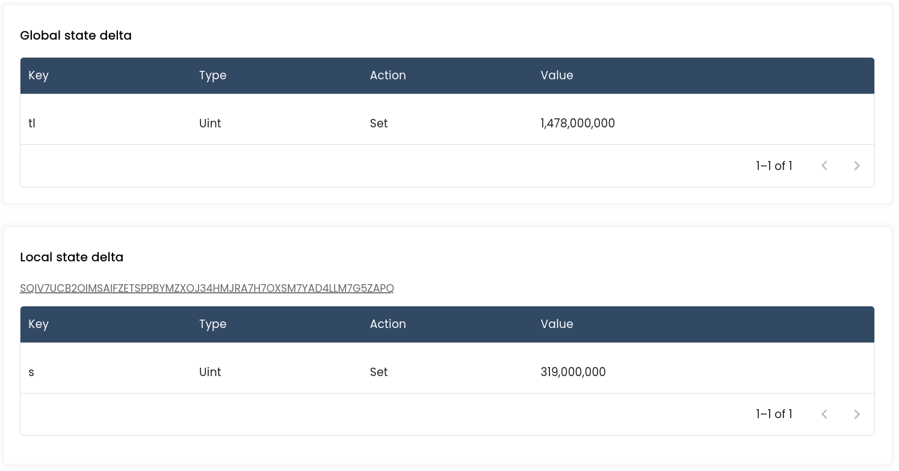

I discovered and disclosed a vulnerability in the [Updog](https://www.updog.vote) and [FAME](https://www.algofame.org/dao) DAO contracts. Then I hacked them. This story is not boring.

## Background: The DAOs

[Updog](https://www.updog.vote) was offered a fully featured DAO platform. In a nutshell:

1) Each DAO instance has a governance token that can be staked and withdrawn.

2) The DAO contracts could control assets and ALGO. Payments of both types could be executed trustlessly after a proposal passed with enough votes.

3) Voting power is proportional to the staked amount of governance tokens in the DAO.

The most notable Updog DAO was the "Coffeebean DAO", which housed a large number of NFTs with an minimum floor value of over 56,000 $ALGO.

The FAME DAO launched recently. It licensed the Updog contracts but had its [own frontend](https://www.algofame.org/dao).

## The vulnerability

Due to insufficient validation in the staking method, a malicious user can drain all governance tokens from the DAO, as well as gain super-majority voting power in the DAO.

### A normal staking call

The staking method normally [looks like this](https://app.dappflow.org/explorer/group/6n2fxAxrIlK7zap1%2BhWitBo0xnCFa1lDGAiEp1g4ih8%3D/33028267/transactions):

1) An asset transfer of the governance token (BEANGOV) to the contract's escrow address (B43GQ..)
2) An Application call with the staking method argument `ls` / `bHM=`

The stake call would then increase the total locked amount (`tl` in global state) and the user's staked amount (`s` in local state.)

### A malicious staking call

The contract code does not validate the staking transaction group's size. This means that a single asset transfer could be padded with 15 staking application calls, and the user would be credited with 15x more stake than they sent.

The credited stake could then be withdrawn (at a cost of 1 ALGO, usually), so to drain the contract of all governance tokens, a user could start with a trivial amount of tokens, and then loop stake-withdraw calls until they withdraw all the tokens. In just 3 deposit-withdraw cycles, the initial governance token would be withdrawn 3375x at a cost of 3 ALGO.

Due to how this story unfolded, you can see an example of this on-chain [here](https://app.dappflow.org/explorer/group/4OMym%2FVi3WKs8PLkEJESsclkQtNUJBI7KGshLgJcTrA%3D/34464554/transactions):

_(It is generally not cool to do this. [Simulate can be used to confirm and disclose a vulnerability](/posts/disclosure-tales-01-honing-fire/#simulating-validation) without leaving the exploit on-chain in plain sight. I plead extenuating circumstances later on.)_

## Disclosure

I disclosed this to the Updog contract developer on November 8, 2023. I sent an apologetic email explaining the situation and offering to help rescue the assets. Since the contracts do not have an admin functionality that can circumvent the voting process, the only way to recover the assets would be to attack the DAOs with this exploit.

## State of Affairs

